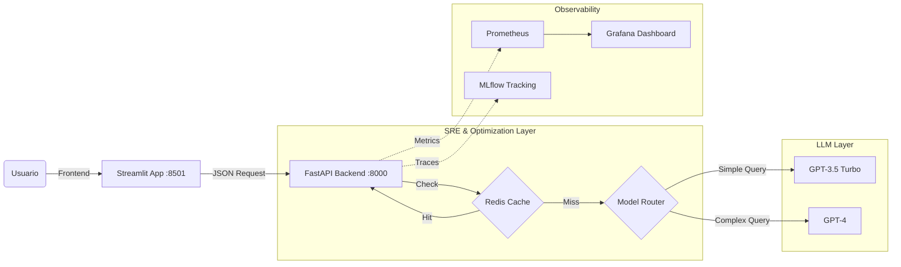

# 🏗️ Asistente Normativa CTE (RAG con Arquitectura MLOps)


> **Asistente inteligente para la Normativa del Código Técnico de la Edificación (CTE)**. No es solo un chat: es una arquitectura de ingeniería de software completa que integra prácticas de MLOps para garantizar escalabilidad, control de costes y observabilidad.

---

## 📋 Descripción del Proyecto

Este proyecto implementa un sistema **End-to-End de Inteligencia Artificial Generativa** (RAG - Retrieval Augmented Generation).

El objetivo es solucionar el problema de consultar normativas técnicas complejas, ofreciendo respuestas precisas y citando fuentes. A diferencia de un prototipo básico, esta solución incluye una capa de **Ingeniería de Fiabilidad (SRE)** que monitoriza cada token generado y optimiza el uso de recursos.

## 🌟 Características Clave

### 🧠 1. Model Routing Inteligente (Cost Optimization)
El sistema no usa siempre el modelo más caro. Incorpora un "Router Semántico" que analiza la complejidad de la pregunta:
* **GPT-3.5 Turbo:** Se activa para saludos, definiciones simples y consultas generales (Baja latencia, coste mínimo).
* **GPT-4:** Se activa automáticamente para tareas de razonamiento complejo, comparativas normativas y análisis profundo.

### ⚡ 2. Caching Semántico con Redis
Implementación de una capa de caché distribuida:
* **Cache Hit:** Si una pregunta ya se ha hecho (o es muy similar), el sistema responde en **<50ms** sin llamar a OpenAI.
* **Impacto:** Reducción drástica de latencia y coste $0 en consultas recurrentes.

### 📊 3. Observabilidad Full-Stack
El sistema no es una "caja negra". Todo está instrumentado:
* **Prometheus:** Recolección de métricas de negocio (Tokens/seg, Coste acumulado, Latencia por modelo).
* **Grafana:** Cuadros de mando visuales para monitorizar la salud del sistema en tiempo real.
* **MLflow:** Trazabilidad completa de experimentos, versionado de prompts y registro de ejecuciones.

---

## 🛠️ Arquitectura Técnica

El sistema sigue una arquitectura de microservicios orquestados mediante Docker:



## 🧰 Stack Tecnológico

| Componente | Tecnología | Función |
| :--- | :--- | :--- |
| **Backend** | Python, FastAPI | API REST asíncrona, validación Pydantic y gestión de errores. |
| **Frontend** | Streamlit | Interfaz de chat interactiva y visualización de métricas en UI. |
| **Orchestration** | LangChain | Gestión de prompts, cadenas de pensamiento y conexión con LLMs. |
| **Database** | Redis (Docker) | Almacenamiento clave-valor de alta velocidad para caché. |
| **Monitoring** | Prometheus | Base de datos de series temporales para métricas. |
| **Visualization** | Grafana | Dashboards operativos. |
| **Tracking** | MLflow | Registro de experimentos y artefactos del modelo. |
| **DevOps** | Docker & Poetry | Gestión de contenedores y dependencias deterministas. |

---

## 🚀 Guía de Instalación y Uso

Sigue estos pasos para levantar el sistema completo en tu máquina local.

### 1. Prerrequisitos
* **Docker Desktop** instalado y corriendo.
* **Python 3.11+** y **Poetry** instalados.
* Una **API Key de OpenAI**.

### 2. Configuración Inicial
Clona el repositorio y configura las variables de entorno:

```bash
git clone [https://github.com/mrsteppenwolf627/rag-mlops.git](https://github.com/mrsteppenwolf627/rag-mlops.git)
cd rag-mlops

# Instalar dependencias
poetry install

# Configurar variables de entorno
# (Crea un archivo .env basado en el ejemplo y añade tu API Key)
cp .env.example .env
```

### 3. Despliegue de Infraestructura (Docker)
Levanta los servicios de soporte (Redis, Prometheus, Grafana, MLflow):

```bash
docker-compose up -d
```
*Espera unos segundos a que todos los contenedores estén "Healthy".*

### 4. Ejecución de la Aplicación
El sistema requiere dos terminales abiertas simultáneamente:

**Terminal 1: Backend (API)**
Este es el cerebro del sistema.
```bash
poetry run uvicorn src.sre.api.main:app --reload --host 0.0.0.0 --port 8000
```

**Terminal 2: Frontend (UI)**
Esta es la interfaz visual.
```bash
poetry run python -m streamlit run src/sre/frontend/app.py
```

---

## 📈 Dashboards y Accesos

Una vez todo esté corriendo, puedes acceder a las diferentes herramientas en estos puertos locales:

| Servicio | URL Local | Credenciales (Default) | Descripción |
| :--- | :--- | :--- | :--- |
| **Frontend App** | `http://localhost:8501` | - | Interactúa con el asistente. |
| **API Docs** | `http://localhost:8000/docs` | - | Swagger UI para probar endpoints. |
| **Grafana** | `http://localhost:3000` | `admin` / `admin` | Visualiza costes y tráfico. |
| **Prometheus** | `http://localhost:9090` | - | Explorador de métricas crudas. |
| **MLflow** | `http://localhost:5000` | - | Registro de trazas y experimentos. |

---

## 📂 Estructura del Proyecto

```text
src/
├── sre/
│   ├── api/            # Endpoints (Routes) y configuración del servidor
│   ├── frontend/       # Interfaz de usuario (Streamlit)
│   ├── generation/     # Lógica RAG, Cliente LLM y Router Inteligente
│   ├── monitoring/     # Definición de métricas Prometheus y Loggers
│   └── utils/          # Cliente Redis y utilidades de caché
scripts/                # Scripts de pruebas de carga (Load Testing)
docker-compose.yml      # Definición de infraestructura
pyproject.toml          # Gestión de dependencias
```

---

*Proyecto desarrollado por Aitor Alarcón.*
